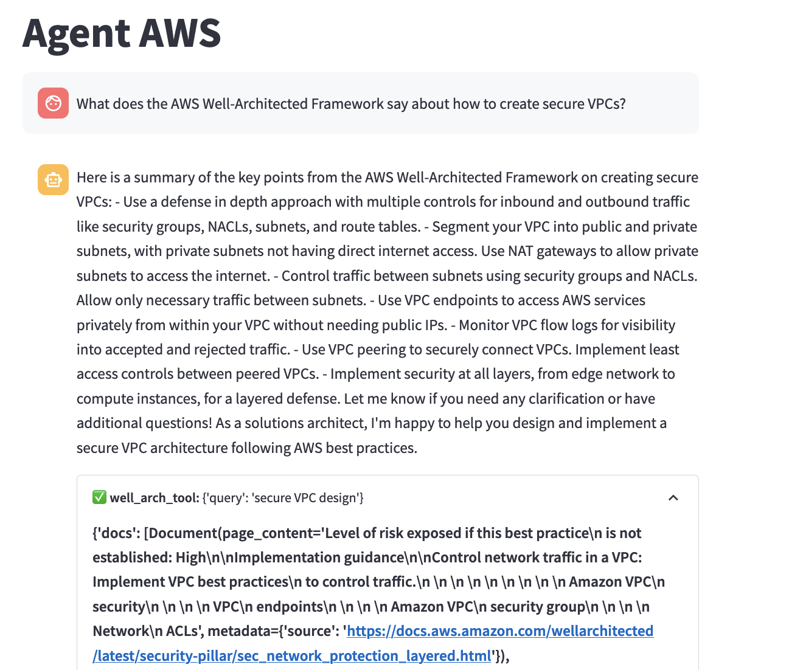

# Amazon Bedrock Custom LangChain Agent

Create a custom LangChain agent dubbed "Agent AWS" that queries the AWS Well-Architected Framework and deploys Lambda functions, all backed by Amazon Bedrock and housed in a Streamlit chatbot.

<div align="center"></div>

## Prerequisites

Before you begin, make sure you have the following:

* AWS Account: You'll need an AWS account with access to Claude via [Amazon Bedrock](https://us-east-1.console.aws.amazon.com/bedrock/home?region=us-east-1#/modelaccess).
* Lambda Role: Create an IAM role with Lambda execution permissions.
* S3 Bucket: Create an S3 bucket to store assets like Python deployment zips for Lambda.
* Python 3.9 or higher

Export these in your terminal:

```bash
export LAMBDA_ROLE=arn:aws:iam::ACCOUNT_ID:role/YourLambdaExecutionRole  
export S3_BUCKET=your_s3_bucket_name_here
```

## Installation

Clone this repository:

```bash
git clone https://github.com/build-on-aws/amazon-bedrock-custom-langchain-agent.git
```

Navigate into the project directory:
```bash
cd amazon-bedrock-custom-langchain-agent
```

Install the required Python packages:

```bash
pip install -r requirements.txt
```

## Usage

Run the Streamlit app:

```bash
streamlit run agent_aws_st.py
```

You can also run the agent in the terminal:

```bash
python agent_aws.py
```

## Security

See [CONTRIBUTING](CONTRIBUTING.md#security-issue-notifications) for more information.

## License

This library is licensed under the MIT-0 License. See the LICENSE file.

